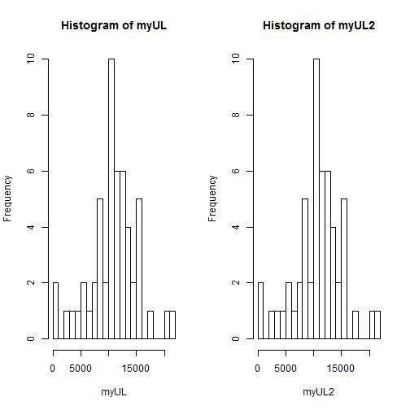
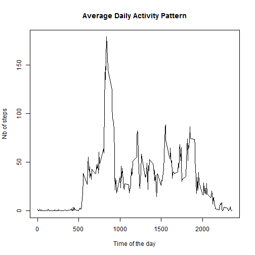
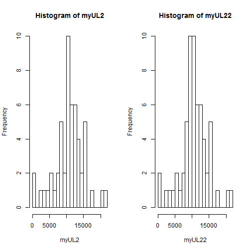
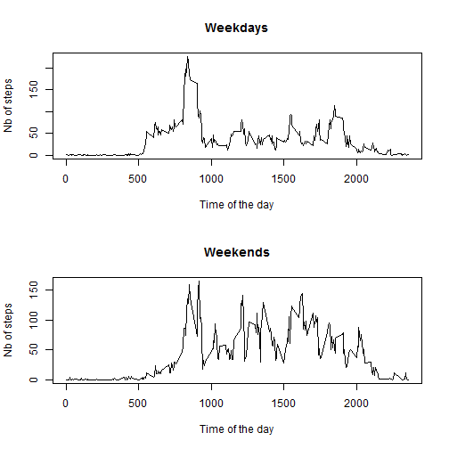
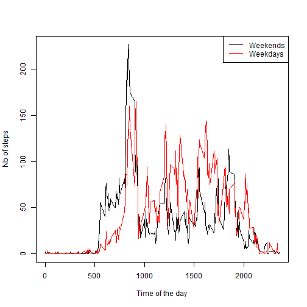

### Loading and preprocessing the data

#### 1. Load the data (i.e. read.csv())

After setting the working directory to the folder where the data resides, we simply use the read.csv function with its default parameters. 

```r
setwd("C:/Users/user/Desktop/Academics/MOOCs/Data Analysis/Data Science - JHU - Coursera/Reproducible Research - JHU - Coursera/Week 2")
myDF=read.csv("activity.csv")
```

#### 2. Process/transform the data (if necessary) into a format suitable for your analysis

The resulting data frame appears to be in a suitable format for the time being. No transformation is necessary at this stage: 


```r
class(myDF)
```

```
## [1] "data.frame"
```

```r
head(myDF)
```

```
##   steps       date interval
## 1    NA 2012-10-01        0
## 2    NA 2012-10-01        5
## 3    NA 2012-10-01       10
## 4    NA 2012-10-01       15
## 5    NA 2012-10-01       20
## 6    NA 2012-10-01       25
```

```r
dim(myDF)
```

```
## [1] 17568     3
```

```r
names(myDF)
```

```
## [1] "steps"    "date"     "interval"
```

```r
class(myDF$steps)
```

```
## [1] "integer"
```

```r
class(myDF$date)
```

```
## [1] "factor"
```

```r
class(myDF$interval)
```

```
## [1] "integer"
```

### What is the mean total number of steps taken per day?

#### 1. Calculate the total number of steps taken per day

We use the "split" function to get the number of steps per day. 

```r
myList=split(myDF$steps,myDF$date) # This creates a list of lists. The inner lists each represent one day, and contain each one integer vector (number of steps per 5-min time intervals) 
class(myList) # This is a list. 
```

```
## [1] "list"
```

```r
length(myList) # This is the total number of days during the 2 months period (61 days)
```

```
## [1] 61
```

```r
class(myList[1]) # The elements within the outer list are lists themselves.
```

```
## [1] "list"
```

```r
myList[1] # We see only NAs for the first day. 
```

```
## $`2012-10-01`
##   [1] NA NA NA NA NA NA NA NA NA NA NA NA NA NA NA NA NA NA NA NA NA NA NA
##  [24] NA NA NA NA NA NA NA NA NA NA NA NA NA NA NA NA NA NA NA NA NA NA NA
##  [47] NA NA NA NA NA NA NA NA NA NA NA NA NA NA NA NA NA NA NA NA NA NA NA
##  [70] NA NA NA NA NA NA NA NA NA NA NA NA NA NA NA NA NA NA NA NA NA NA NA
##  [93] NA NA NA NA NA NA NA NA NA NA NA NA NA NA NA NA NA NA NA NA NA NA NA
## [116] NA NA NA NA NA NA NA NA NA NA NA NA NA NA NA NA NA NA NA NA NA NA NA
## [139] NA NA NA NA NA NA NA NA NA NA NA NA NA NA NA NA NA NA NA NA NA NA NA
## [162] NA NA NA NA NA NA NA NA NA NA NA NA NA NA NA NA NA NA NA NA NA NA NA
## [185] NA NA NA NA NA NA NA NA NA NA NA NA NA NA NA NA NA NA NA NA NA NA NA
## [208] NA NA NA NA NA NA NA NA NA NA NA NA NA NA NA NA NA NA NA NA NA NA NA
## [231] NA NA NA NA NA NA NA NA NA NA NA NA NA NA NA NA NA NA NA NA NA NA NA
## [254] NA NA NA NA NA NA NA NA NA NA NA NA NA NA NA NA NA NA NA NA NA NA NA
## [277] NA NA NA NA NA NA NA NA NA NA NA NA
```

```r
length(myList[1]) # Each inner list is of length 1. It actually contains a vector of integers. 
```

```
## [1] 1
```

We can access the content of each of the inner lists by using the "double squared-bracket" subsetting ("[[]]"). 

```r
class(myList[[10]]) # The double squared-bracket enables us to directly access the content of the inner list, that is the integer vector. 
```

```
## [1] "integer"
```

```r
myList[[10]]
```

```
##   [1]  34  18   7   0   0   0   0   0   0   0   0   0   0   0   0   0   0
##  [18]   0   0   0   0   0   0   0   0   0   0   0   0   0   0   0   0   0
##  [35]   0   0   0   0   0   0   0   0   0   0   0   0   0   0   0   0   0
##  [52]   0   0   0   0   0   0   0   0   0   0  34   0   0   0   0   0   0
##  [69]   0   0   0   0   0   7   9  36   0  47  67   0  49  23  15  29  42
##  [86]  49  92  28  33  63  97  90 101  55  75  40  47  22  61   0   0   0
## [103]   0   0   0  60  54  16 135  61  69  32   0   0  17   0   0  69   0
## [120]  20 400 105 292 291  30   0   0  40  38   0   0   0   0   0   0  72
## [137]  37   0   0  25  17   0   0  88   7 413 326  93 334 317   0   0   0
## [154]   0  68 129   0   0   0   0   0   0   0   0   0   0   0   0   0   0
## [171] 103 119   0   0   0  70 125   0   0   0   0   0   0   0   0   0 176
## [188]  71  43 340   7  13  15   0   0   0   0   0   0   0   0   0   0  15
## [205]  50 271 106 272 308   0   0 111 281  11 139  36   0   0   0   0   0
## [222]   0  58  63 260  82 310   0   0   0   8  12 364 219   0   0   0 174
## [239] 205  12   0   0  11  17   0   0  37   0   0 105  34   0 152   0   0
## [256]   0   0   0   0   0   0   0   0   0   0   0   0 112  23  12   8   0
## [273]   0   0   0   0   7   0   0   0   0   0   0   0   0   0   8   0
```

```r
length(myList[[1]]) # These are the number of 5-min intervals during the day. This is the same value for each day (288).
```

```
## [1] 288
```
We can also access the data for the number of steps within the 5-min intervals. That is, the single elements of the integer vector of each list. 


```r
myList[[10]][1] # This way of using squared brackets followed by single brackets enables us to access individual elements of the integer vectors. 
```

```
## [1] 34
```

```r
myList[[10]][111]
```

```
## [1] 69
```

Now we want to calculate the total number of steps for each day. So we want to sum the values of each of our integer vectors. 


```r
myLA=lapply(myList,sum) # The lapply function enables us to iteratively sum all the values of each integer vector, keeping the final result as a list of sum results. 
head(myLA)
```

```
## $`2012-10-01`
## [1] NA
## 
## $`2012-10-02`
## [1] 126
## 
## $`2012-10-03`
## [1] 11352
## 
## $`2012-10-04`
## [1] 12116
## 
## $`2012-10-05`
## [1] 13294
## 
## $`2012-10-06`
## [1] 15420
```

```r
class(myLA)
```

```
## [1] "list"
```

```r
myUL=unlist(myLA) # For convenience, we "unlist", that is, we transform our list in a simple integer vector. 
class(myUL) # As expected the result is an integer vector
```

```
## [1] "integer"
```

```r
length(myUL) # As expected, the result is the number of days in the 2 months period, (61 days)
```

```
## [1] 61
```

```r
myUL # This integer vector has for each day the total number of steps
```

```
## 2012-10-01 2012-10-02 2012-10-03 2012-10-04 2012-10-05 2012-10-06 
##         NA        126      11352      12116      13294      15420 
## 2012-10-07 2012-10-08 2012-10-09 2012-10-10 2012-10-11 2012-10-12 
##      11015         NA      12811       9900      10304      17382 
## 2012-10-13 2012-10-14 2012-10-15 2012-10-16 2012-10-17 2012-10-18 
##      12426      15098      10139      15084      13452      10056 
## 2012-10-19 2012-10-20 2012-10-21 2012-10-22 2012-10-23 2012-10-24 
##      11829      10395       8821      13460       8918       8355 
## 2012-10-25 2012-10-26 2012-10-27 2012-10-28 2012-10-29 2012-10-30 
##       2492       6778      10119      11458       5018       9819 
## 2012-10-31 2012-11-01 2012-11-02 2012-11-03 2012-11-04 2012-11-05 
##      15414         NA      10600      10571         NA      10439 
## 2012-11-06 2012-11-07 2012-11-08 2012-11-09 2012-11-10 2012-11-11 
##       8334      12883       3219         NA         NA      12608 
## 2012-11-12 2012-11-13 2012-11-14 2012-11-15 2012-11-16 2012-11-17 
##      10765       7336         NA         41       5441      14339 
## 2012-11-18 2012-11-19 2012-11-20 2012-11-21 2012-11-22 2012-11-23 
##      15110       8841       4472      12787      20427      21194 
## 2012-11-24 2012-11-25 2012-11-26 2012-11-27 2012-11-28 2012-11-29 
##      14478      11834      11162      13646      10183       7047 
## 2012-11-30 
##         NA
```

```r
myUL2=myUL[!is.na(myUL)] # We subset out the days for which there are some NAs. 
length(myUL2) # We have now 53 days in our integer vector, compared to 61 previously. 
```

```
## [1] 53
```

```r
myUL2 # This is the total number of steps take per day. 
```

```
## 2012-10-02 2012-10-03 2012-10-04 2012-10-05 2012-10-06 2012-10-07 
##        126      11352      12116      13294      15420      11015 
## 2012-10-09 2012-10-10 2012-10-11 2012-10-12 2012-10-13 2012-10-14 
##      12811       9900      10304      17382      12426      15098 
## 2012-10-15 2012-10-16 2012-10-17 2012-10-18 2012-10-19 2012-10-20 
##      10139      15084      13452      10056      11829      10395 
## 2012-10-21 2012-10-22 2012-10-23 2012-10-24 2012-10-25 2012-10-26 
##       8821      13460       8918       8355       2492       6778 
## 2012-10-27 2012-10-28 2012-10-29 2012-10-30 2012-10-31 2012-11-02 
##      10119      11458       5018       9819      15414      10600 
## 2012-11-03 2012-11-05 2012-11-06 2012-11-07 2012-11-08 2012-11-11 
##      10571      10439       8334      12883       3219      12608 
## 2012-11-12 2012-11-13 2012-11-15 2012-11-16 2012-11-17 2012-11-18 
##      10765       7336         41       5441      14339      15110 
## 2012-11-19 2012-11-20 2012-11-21 2012-11-22 2012-11-23 2012-11-24 
##       8841       4472      12787      20427      21194      14478 
## 2012-11-25 2012-11-26 2012-11-27 2012-11-28 2012-11-29 
##      11834      11162      13646      10183       7047
```

#### 2. If you do not understand the difference between a histogram and a barplot, research the difference between them. Make a histogram of the total number of steps taken each day


```r
par(mfrow=c(1,2))
hist(myUL,breaks=20)
hist(myUL2,breaks=20) # We observe that there is no difference between the 2 histograms: removing the days where there were NAs was actually taken care of by default within the "hist" function.
```

 

#### 3. Calculate and report the mean and median of the total number of steps taken per day

```r
mean(myUL) # the mean function does not work by default when some elements contain NAs
```

```
## [1] NA
```

```r
mean(myUL,na.rm=TRUE) # We get a result when specifying the option na.rm=TRUE
```

```
## [1] 10766.19
```

```r
mean(myUL2) # We check that removing the NAs manually gives the same result as the option above.
```

```
## [1] 10766.19
```

```r
median(myUL) # the median function does not work by default when some elements contain NAs
```

```
## [1] NA
```

```r
median(myUL,na.rm=TRUE) # We get a result when specifying the option na.rm=TRUE
```

```
## [1] 10765
```

```r
median(myUL2) # We check that removing the NAs manually gives the same result as the option above.
```

```
## [1] 10765
```

### What is the average daily activity pattern?

#### 1. Make a time series plot (i.e. type = "l") of the 5-minute interval (x-axis) and the average number of steps taken, averaged across all days (y-axis)

We opt here for a mechanistic approach, counting NAs as 0 and considering that each 5-min slot is represented 61 times. 


```r
A=rep(0,288)
for (i in 1:288){
  for (j in 1:61){
    if (is.na(myList[[j]][i])){
      A[i]=A[i]
  }
    else{
      A[i]=A[i]+myList[[j]][i]
    }}
  A[i]=A[i]/61
}
head(A)
```

```
## [1] 1.49180328 0.29508197 0.11475410 0.13114754 0.06557377 1.81967213
```

```r
par(mfrow=c(1,1))
plot(myDF$interval[1:288],A,type="l",xlab="Time of the day",ylab="Nb of steps",main="Average Daily Activity Pattern")
```

 

#### 2. Which 5-minute interval, on average across all the days in the dataset, contains the maximum number of steps?
Here we simply make use of the which.max function to find the position of the max within the vector A that was defined above. 


```r
which.max(A)
```

```
## [1] 104
```

```r
myDF$interval[which.max(A)] # this is the time from 8h35 to 8h40 AM
```

```
## [1] 835
```

### Imputing missing values

#### 1. Calculate and report the total number of missing values in the dataset (i.e. the total number of rows with NAs)

We here simply use the is.na function. 


```r
sum(is.na(myDF$steps))
```

```
## [1] 2304
```

#### 2. Devise a strategy for filling in all of the missing values in the dataset. The strategy does not need to be sophisticated. For example, you could use the mean/median for that day, or the mean for that 5-minute interval, etc.

We will replace each NA by the mean number of steps for that given time interval, averaged across all days. 

#### 3. Create a new dataset that is equal to the original dataset but with the missing data filled in.

We start by creating a copy of our original data frame. 

```r
myDF2=myDF
```

We then replace its NA by the mean value for that time slot as computed previously (this average value is in the variable A).

```r
for (i in 1:61){
  for (j in 1:288){
    if (is.na(myList[[i]][j])){
      myDF2$steps[(i-1)*288+j]=A[j]
  }}}
```

We then use the same strategy as previously to sum the total number of steps for each day. 


```r
myList2=split(myDF2$steps,myDF2$date) 
myLA2=lapply(myList2,sum) 
myUL22=unlist(myLA2)
```

#### 4. Make a histogram of the total number of steps taken each day and Calculate and report the mean and median total number of steps taken per day. Do these values differ from the estimates from the first part of the assignment? What is the impact of imputing missing data on the estimates of the total daily number of steps?

We draw the 2 histograms next to each other to compare the effect of replacing NAs with the average for the slot. 


```r
par(mfrow=c(1,2))
hist(myUL2,breaks=20)
hist(myUL22,breaks=20) 
```

 

We see that the average number of steps taken each day increases by about 200 steps, while the median number of steps increases by 370 steps.


```r
mean(myUL22)
```

```
## [1] 10581.01
```

```r
mean(myUL2) 
```

```
## [1] 10766.19
```

```r
median(myUL22)
```

```
## [1] 10395
```

```r
median(myUL2)
```

```
## [1] 10765
```

### Are there differences in activity patterns between weekdays and weekends?

#### 1. Create a new factor variable in the dataset with two levels - "weekday" and "weekend" indicating whether a given date is a weekday or weekend day. 

We create a vector that says whether each date in our data frame is a weekday or falls in a weekend. 
Then we add that vector to our data frame. 


```r
myWeekdays=weekdays(as.Date(myDF2$date))
myWeekdays[myWeekdays=="Saturday" | myWeekdays=="Sunday"]="weekend"
myWeekdays[myWeekdays!="weekend"]="weekday"
myDF2$weekday=as.factor(myWeekdays)
head(myDF2$weekday)
```

```
## [1] weekday weekday weekday weekday weekday weekday
## Levels: weekday weekend
```

```r
tail(myDF2$weekday)
```

```
## [1] weekday weekday weekday weekday weekday weekday
## Levels: weekday weekend
```

#### 2. Make a panel plot containing a time series plot (i.e. type = "l") of the 5-minute interval (x-axis) and the average number of steps taken, averaged across all weekday days or weekend days (y-axis)
For that we create to subsets of our new data frame, one with weekdays only and one with weekends only. 


```r
DF1=myDF2[myDF2$weekday=="weekday",]
DF2=myDF2[myDF2$weekday=="weekend",]
```

We check that we have not lost any data in the process. 

```r
dim(myDF2)[1]
```

```
## [1] 17568
```

```r
dim(DF1)[1]
```

```
## [1] 12960
```

```r
dim(DF2)[1]
```

```
## [1] 4608
```

```r
dim(myDF2)[1]==dim(DF1)[1]+dim(DF2)[1]
```

```
## [1] TRUE
```

```r
a=dim(DF1)[1]/288 # this is 45
b=dim(DF2)[1]/288 # this is 16 
```

We see that there are 45 weekdays and 16 weekend days. 
We now loop over the total number of weekdays/weekends to compute our average.


```r
B=rep(0,288)
for (i in 1:288){
  for (j in 1:45){
      B[i]=B[i]+DF1$steps[(j-1)*288+i]}
  B[i]=B[i]/a
}

C=rep(0,288)
for (i in 1:288){
  for (j in 1:16){
      C[i]=C[i]+DF2$steps[(j-1)*288+i]}
  C[i]=C[i]/b
}
```

We finally plot our desired curves. One option is to have 2 separate plots... 

```r
par(mfrow=c(2,1))
plot(myDF$interval[1:288],B,type="l",main="Weekdays",xlab="Time of the day",ylab="Nb of steps")
plot(myDF$interval[1:288],C,type="l",main="Weekends",xlab="Time of the day",ylab="Nb of steps")
```

 

... or to have one plot with the 2 curves on the same plot.

```r
par(mfrow=c(1,1))
plot(myDF$interval[1:288],B,type="l",xlab="Time of the day",ylab="Nb of steps")
lines(myDF$interval[1:288],C,col="red")
legend("topright",col=c("black","red"),legend=c("Weekends","Weekdays"),lwd=1)
```

 

